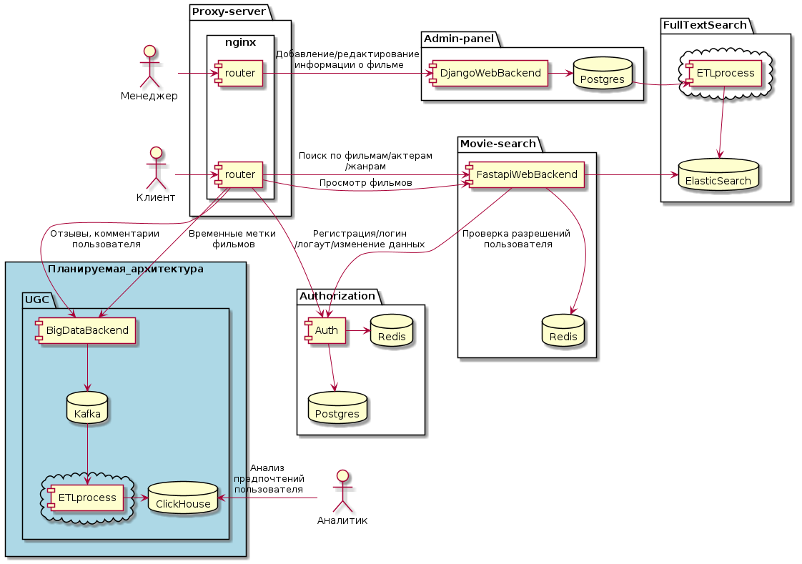
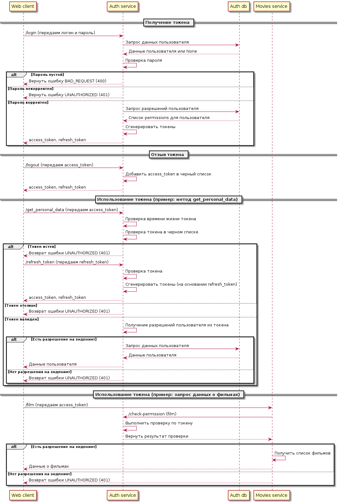
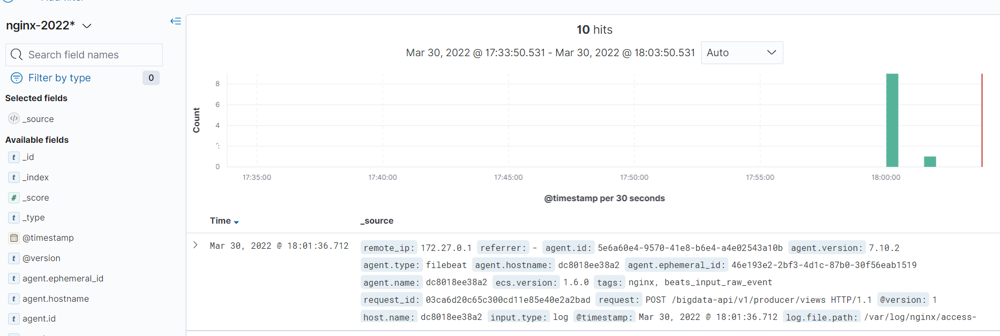

# Проектная работа 8 спринта
Задачи можно посмотреть в /tasks

## Ссылка на репозиторий с проектом:
https://github.com/AlexanderNkn/ugc_sprint_2

## Описание
Это API для для сохранения информации о просматриваемом пользователем фильме. Данные сохраняются потоком в событийную базу данных Kafka, а из нее в фоне ETL-процессом перекладываются в аналитическую базу ClickHouse.

## Установка
- склонируйте проект с реппозитория GitHub
    ```
    git clone https://github.com/AlexanderNkn/ugc_sprint_2.git
    ```
- переименуйте файл с переменными окружения для тестирования
    ```
    mv bigdata_api/envs/.bigdata_api.env.sample bigdata_api/envs/.bigdata_api.env
    mv bigdata_etl/envs/.bigdata_etl.env.sample bigdata_etl/envs/.bigdata_etl.env
    ```
- соберите образ
    ```
    docker-compose build --no-cache
    ```
- запустите проект
    ```
    docker-compose up -d
    ```

## Документация 
- Доступна по адресу
    ```
    http://localhost/bigdata-api/openapi
    ```
- В json формате
    ```
    http://localhost/bigdata-api/openapi.json
    ```

## Тесты 
- Запуск тестов в контейнере через pytest
    ```
    docker-compose exec bigdata-api pytest
    ```

## Использование
### отправка данных в Kafka
- 
    ```
    localhost/bigdata-api/v1/producer/views
    
    curl --location --request POST 'localhost/bigdata-api/v1/producer/views' \
    --header 'Content-Type: application/json' \
    --data-raw '{
        "user_id": "46a5143b-9fbe-4483-a9be-30ebccf7132c",
        "movie_id": "46a5143b-9fbe-4483-a9be-30ebccf7132c",
        "movie_time_offset": 124000,
        "created_at": "2022-02-03 12:03:05"
    }'

    201 Created

    {
        "message": "acknowledged",
        "status": "success"
    }
    ```

### получение последней временной метки для конкретного пользователя и фильма

- Для просмотра данных, переданных в ClickHouse подключитесь к первой ноде
    ```
    docker-compose exec clickhouse-node1 clickhouse-client 
    ```

- пример запроса для получения метки последнего просмотра выбранного конкретного пользователя и фильма
    ```
    clickhouse-node1 :) SELECT * FROM movies.latest_view FINAL;
    
    SELECT *
    FROM movies.latest_view
    FINAL
    
    Query id: 6fa40801-f0f4-4198-b64d-aea4ea5bdb04
    
    ┌─user_id──────────────────────────────┬─movie_id─────────────────────────────┬─movie_time_offset─┬──────────created_at─┐
    │ 46a5143b-9fbe-4483-a9be-30ebccf7132c │ 46a5143b-9fbe-4483-a9be-30ebccf7132c │            124000 │ 2022-02-03 12:03:05 │
    └──────────────────────────────────────┴──────────────────────────────────────┴───────────────────┴─────────────────────┘
    
    1 rows in set. Elapsed: 0.003 sec.
    ```
## Архитектурные решения
- описание диаграмм в формате plantUML представлено в docs/architecture/

### Планируемая работа


### Аутентификация

## Выбор аналитической базы данных
Сравнивали Vertica и ClickHouse. На нашем наборе данных ClickHouse показала лучшие результаты

Записано 55000 записей в Vetrica за 1.0577869415283203 
Прочитано 55000 записей в Vetrica за 0.9722421169281006 
Записано 55000 записей в ClickHouse за 0.23347997665405273 
Прочитано 55000 записей в ClickHouse за 0.07249212265014648

Скрипты находятся в calculations/choosing_storage
Описание запуска проекта в [readme](calculations/choosing_storage/README.md)

## Логирование

### Sentry

### ELK

Логи через logstash собираются в elasticsearch. В проекте использовано 2 способа отправки:
- из сервиса bigdata_api, написанного на fastapi, с использованием библиотеки  [python-logstash-async](https://python-logstash-async.readthedocs.io/en/stable/index.html)
- из nginx через общий файл - сервис nginx записывает логи в файл, сервис filebeat читает и отправляет их в logstash.

Просмотреть логи можно через сервис [kibana](https://www.elastic.co/kibana/) по адресу http://127.0.0.1:5601/. 
- Пример логов в kibana

